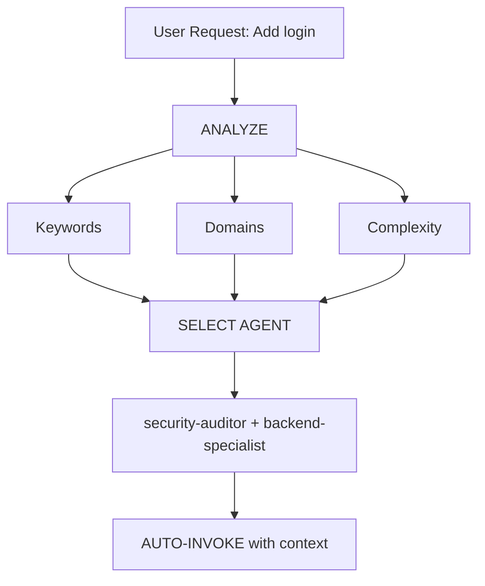

# LÝ THUYẾT VÀ TIẾN TRÌNH LUÂN CHUYỂN
- Định danh kỹ năng: `[Agentic-Loop]`
- Sử dụng khi: Hệ thống yêu cầu tự động build 1 tính năng hoặc module với cam kết "KHÔNG RA LỖI THÌ MỚI DỪNG".

## PHÂN RÃ HÀNH ĐỘNG
1. **Context & Requirement**:
   - Quét file cần thiết. Hỏi Người Dùng nếu ngữ cảnh thiếu hụt mờ nhạt.
2. **Hợp Đồng (Contract & Constraints)**:
   - Viết list rõ thứ sẽ làm và không làm. 
3. **Thực thi (Calling Tools)**:
   - Viết code với mức độ cực kỳ tập trung không dư thừa rác thẻ.
4. **Đánh giá (Metrics Verification)**:
   - Nạp các thông số xác nhận: `[Test Passed = %]`, `[Bugs = Số lượng]`. 
5. **Phản tỉnh (Self-Reflection)**: 
   - Đọc Bug -> Bày cách Fix -> Thực thi Fix -> Quay Lại số (4) cho đến khi `[Bugs = 0]`.

> **QUY TẮC CỐT LÕI**: Đừng bao giờ bàn giao code cho Người Dùng nếu Reflect cho thấy có lỗi tiềm ẩn. Kỹ năng này bắt ép AI phải tự fix đến khi mượt mà mới bàn giao báo cáo.


<!-- MERGED FROM plan-writing -->

---
name: plan-writing
description: Structured task planning with clear breakdowns, dependencies, and verification criteria.
category: tools
version: 4.1.0-fractal
layer: master-skill
---

# Plan Writing

> Source: obra/superpowers

## Overview
This skill provides a framework for breaking down work into clear, actionable tasks with verification criteria.

## Task Breakdown Principles

## 🧠 Knowledge Modules (Fractal Skills)

### 1. [1. Small, Focused Tasks](./sub-skills/1-small-focused-tasks.md)
### 2. [2. Clear Verification](./sub-skills/2-clear-verification.md)
### 3. [3. Logical Ordering](./sub-skills/3-logical-ordering.md)
### 4. [4. Dynamic Naming in Project Root](./sub-skills/4-dynamic-naming-in-project-root.md)
### 5. [Principle 1: Keep It SHORT](./sub-skills/principle-1-keep-it-short.md)
### 6. [Principle 2: Be SPECIFIC, Not Generic](./sub-skills/principle-2-be-specific-not-generic.md)
### 7. [Principle 3: Dynamic Content Based on Project Type](./sub-skills/principle-3-dynamic-content-based-on-project-type.md)
### 8. [Principle 4: Scripts Are Project-Specific](./sub-skills/principle-4-scripts-are-project-specific.md)
### 9. [Principle 5: Verification is Simple](./sub-skills/principle-5-verification-is-simple.md)


<!-- MERGED FROM concise-planning -->

---
version: 4.1.0-fractal
name: concise-planning
description: Use when a user asks for a plan for a coding task, to generate a clear, actionable, and atomic checklist.
---

# Concise Planning

## Goal

Turn a user request into a **single, actionable plan** with atomic steps.

## Workflow

## 🧠 Knowledge Modules (Fractal Skills)

### 1. [1. Scan Context](./sub-skills/1-scan-context.md)
### 2. [2. Minimal Interaction](./sub-skills/2-minimal-interaction.md)
### 3. [3. Generate Plan](./sub-skills/3-generate-plan.md)


<!-- MERGED FROM brainstorming -->

---
name: brainstorming
description: Socratic questioning protocol + user communication. MANDATORY for complex requests, new features, or unclear requirements. Includes progress reporting and error handling.
allowed-tools: Read, Glob, Grep
---

# Brainstorming & Communication Protocol

> **MANDATORY:** Use for complex/vague requests, new features, updates.

---

## 🛑 SOCRATIC GATE (ENFORCEMENT)

### When to Trigger

| Pattern | Action |
|---------|--------|
| "Build/Create/Make [thing]" without details | 🛑 ASK 3 questions |
| Complex feature or architecture | 🛑 Clarify before implementing |
| Update/change request | 🛑 Confirm scope |
| Vague requirements | 🛑 Ask purpose, users, constraints |

### 🚫 MANDATORY: 3 Questions Before Implementation

1. **STOP** - Do NOT start coding
2. **ASK** - Minimum 3 questions:
   - 🎯 Purpose: What problem are you solving?
   - 👥 Users: Who will use this?
   - 📦 Scope: Must-have vs nice-to-have?
3. **WAIT** - Get response before proceeding

---

## 🧠 Dynamic Question Generation

**⛔ NEVER use static templates.** Read `dynamic-questioning.md` for principles.

### Core Principles

| Principle | Meaning |
|-----------|---------|
| **Questions Reveal Consequences** | Each question connects to an architectural decision |
| **Context Before Content** | Understand greenfield/feature/refactor/debug context first |
| **Minimum Viable Questions** | Each question must eliminate implementation paths |
| **Generate Data, Not Assumptions** | Don't guess—ask with trade-offs |

### Question Generation Process

```
1. Parse request → Extract domain, features, scale indicators
2. Identify decision points → Blocking vs. deferable
3. Generate questions → Priority: P0 (blocking) > P1 (high-leverage) > P2 (nice-to-have)
4. Format with trade-offs → What, Why, Options, Default
```

### Question Format (MANDATORY)

```markdown
### [PRIORITY] **[DECISION POINT]**

**Question:** [Clear question]

**Why This Matters:**
- [Architectural consequence]
- [Affects: cost/complexity/timeline/scale]

**Options:**
| Option | Pros | Cons | Best For |
|--------|------|------|----------|
| A | [+] | [-] | [Use case] |

**If Not Specified:** [Default + rationale]
```

**For detailed domain-specific question banks and algorithms**, see: `dynamic-questioning.md`

---

## Progress Reporting (PRINCIPLE-BASED)

**PRINCIPLE:** Transparency builds trust. Status must be visible and actionable.

### Status Board Format

| Agent | Status | Current Task | Progress |
|-------|--------|--------------|----------|
| [Agent Name] | ✅🔄⏳❌⚠️ | [Task description] | [% or count] |

### Status Icons

| Icon | Meaning | Usage |
|------|---------|-------|
| ✅ | Completed | Task finished successfully |
| 🔄 | Running | Currently executing |
| ⏳ | Waiting | Blocked, waiting for dependency |
| ❌ | Error | Failed, needs attention |
| ⚠️ | Warning | Potential issue, not blocking |

---

## Error Handling (PRINCIPLE-BASED)

**PRINCIPLE:** Errors are opportunities for clear communication.

### Error Response Pattern

```
1. Acknowledge the error
2. Explain what happened (user-friendly)
3. Offer specific solutions with trade-offs
4. Ask user to choose or provide alternative
```

### Error Categories

| Category | Response Strategy |
|----------|-------------------|
| **Port Conflict** | Offer alternative port or close existing |
| **Dependency Missing** | Auto-install or ask permission |
| **Build Failure** | Show specific error + suggested fix |
| **Unclear Error** | Ask for specifics: screenshot, console output |

---

## Completion Message (PRINCIPLE-BASED)

**PRINCIPLE:** Celebrate success, guide next steps.

### Completion Structure

```
1. Success confirmation (celebrate briefly)
2. Summary of what was done (concrete)
3. How to verify/test (actionable)
4. Next steps suggestion (proactive)
```

---

## Communication Principles

| Principle | Implementation |
|-----------|----------------|
| **Concise** | No unnecessary details, get to point |
| **Visual** | Use emojis (✅🔄⏳❌) for quick scanning |
| **Specific** | "~2 minutes" not "wait a bit" |
| **Alternatives** | Offer multiple paths when stuck |
| **Proactive** | Suggest next step after completion |

---

## Anti-Patterns (AVOID)

| Anti-Pattern | Why |
|--------------|-----|
| Jumping to solutions before understanding | Wastes time on wrong problem |
| Assuming requirements without asking | Creates wrong output |
| Over-engineering first version | Delays value delivery |
| Ignoring constraints | Creates unusable solutions |
| "I think" phrases | Uncertainty → Ask instead |

---


<!-- MERGED FROM global-orchestrator -->

---
name: global-orchestrator
description: Kỹ năng điều phối trung tâm để kích hoạt các kỹ năng cốt lõi dựa trên Global Rules dựa vào số liệu.
---

# THÔNG SỐ SKILL
- Tên dễ gọi: `Global-Orchestrator`
- Tốc độ rẽ nhánh: Siêu tốc (< 2 steps).
- Nhiệm vụ chính: Dùng để phân tích yêu cầu Người Dùng -> Điều phối các skills cốt lõi (Core Skills) sao cho tối ưu Token & Minh bạch hệ thống.

## 1. TÍCH HỢP CÁC CORE SKILLS
Skill này đứng ở trung tâm (Hub) và kéo các vệ tinh:
- `Frontend (UI-UX)`: Gọi khi cần giao diện sắc nét => Kích hoạt tự động `modern-web-architect`.
- `Backend (Data Core)`: Gọi khi cấu trúc Models/Logic => Kích hoạt `nodejs-backend-patterns` hoặc `database-design`.
- `DevOps (Deploy)`: Gọi khi đẩy server => Kích hoạt `server-management`.
- `Security (Armor)`: Khi liên quan đến Xác thực (Auth), Thanh toán => Kích `penetration-tester-master`.

## 2. QUY TRÌNH HÀNH ĐỘNG CỦA SKILL NÀY
- Phân loại (Triage): Dán nhãn tác vụ `[Giao diện]`, `[Backend]`, `[Bảo mật]`, hoặc `[DevOps]`.
- Số liệu: Đưa ra bảng dự báo tài nguyên, phần trăm độ khó. Ví dụ: `[Độ khó: 40%], [Cần 2 Core Skills], [Rủi ro Bug = 0]`.
- Report: Chỉ in kết quả chốt cuối cùng, cắt bỏ văn dài.

## 3. LỜI NHẮC CỐT LÕI
- Đừng lạm dụng tất cả skills hiện có. Hãy chọn lọc 1-2 skills mạnh nhất và giao toàn quyền cho chúng. Tối đa hóa token bằng tư duy lược bỏ.


<!-- MERGED FROM intelligent-routing -->

---
name: intelligent-routing
description: Automatic agent selection and intelligent task routing. Analyzes user requests and automatically selects the best specialist agent(s) without requiring explicit user mentions.
version: 1.0.0
---

# Intelligent Agent Routing

**Purpose**: Automatically analyze user requests and route them to the most appropriate specialist agent(s) without requiring explicit user mentions.

## Core Principle

> **The AI should act as an intelligent Project Manager**, analyzing each request and automatically selecting the best specialist(s) for the job.

## How It Works

### 1. Request Analysis

Before responding to ANY user request, perform automatic analysis:



### 2. Agent Selection Matrix

**Use this matrix to automatically select agents:**

| User Intent         | Keywords                                   | Selected Agent(s)                           | Auto-invoke? |
| ------------------- | ------------------------------------------ | ------------------------------------------- | ------------ |
| **Authentication**  | "login", "auth", "signup", "password"      | `security-auditor` + `backend-specialist`   | ✅ YES       |
| **UI Component**    | "button", "card", "layout", "style"        | `frontend-specialist`                       | ✅ YES       |
| **Mobile UI**       | "screen", "navigation", "touch", "gesture" | `mobile-developer`                          | ✅ YES       |
| **API Endpoint**    | "endpoint", "route", "API", "POST", "GET"  | `backend-specialist`                        | ✅ YES       |
| **Database**        | "schema", "migration", "query", "table"    | `database-architect` + `backend-specialist` | ✅ YES       |
| **Bug Fix**         | "error", "bug", "not working", "broken"    | `debugger`                                  | ✅ YES       |
| **Test**            | "test", "coverage", "unit", "e2e"          | `test-engineer`                             | ✅ YES       |
| **Deployment**      | "deploy", "production", "CI/CD", "docker"  | `devops-engineer`                           | ✅ YES       |
| **Security Review** | "security", "vulnerability", "exploit"     | `security-auditor` + `penetration-tester`   | ✅ YES       |
| **Performance**     | "slow", "optimize", "performance", "speed" | `performance-optimizer`                     | ✅ YES       |
| **Product Def**     | "requirements", "user story", "backlog", "MVP" | `product-owner`                             | ✅ YES       |
| **New Feature**     | "build", "create", "implement", "new app"  | `orchestrator` → multi-agent                | ⚠️ ASK FIRST |
| **Complex Task**    | Multiple domains detected                  | `orchestrator` → multi-agent                | ⚠️ ASK FIRST |

### 3. Automatic Routing Protocol

## TIER 0 - Automatic Analysis (ALWAYS ACTIVE)

Before responding to ANY request:

```javascript
// Pseudo-code for decision tree
function analyzeRequest(userMessage) {
    // 1. Classify request type
    const requestType = classifyRequest(userMessage);

    // 2. Detect domains
    const domains = detectDomains(userMessage);

    // 3. Determine complexity
    const complexity = assessComplexity(domains);

    // 4. Select agent(s)
    if (complexity === "SIMPLE" && domains.length === 1) {
        return selectSingleAgent(domains[0]);
    } else if (complexity === "MODERATE" && domains.length <= 2) {
        return selectMultipleAgents(domains);
    } else {
        return "orchestrator"; // Complex task
    }
}
```

## 4. Response Format

**When auto-selecting an agent, inform the user concisely:**

```markdown
🤖 **Applying knowledge of `@security-auditor` + `@backend-specialist`...**

[Proceed with specialized response]
```

**Benefits:**

- ✅ User sees which expertise is being applied
- ✅ Transparent decision-making
- ✅ Still automatic (no /commands needed)

## Domain Detection Rules

### Single-Domain Tasks (Auto-invoke Single Agent)

| Domain          | Patterns                                   | Agent                   |
| --------------- | ------------------------------------------ | ----------------------- |
| **Security**    | auth, login, jwt, password, hash, token    | `security-auditor`      |
| **Frontend**    | component, react, vue, css, html, tailwind | `frontend-specialist`   |
| **Backend**     | api, server, express, fastapi, node        | `backend-specialist`    |
| **Mobile**      | react native, flutter, ios, android, expo  | `mobile-developer`      |
| **Database**    | prisma, sql, mongodb, schema, migration    | `database-architect`    |
| **Testing**     | test, jest, vitest, playwright, cypress    | `test-engineer`         |
| **DevOps**      | docker, kubernetes, ci/cd, pm2, nginx      | `devops-engineer`       |
| **Debug**       | error, bug, crash, not working, issue      | `debugger`              |
| **Performance** | slow, lag, optimize, cache, performance    | `performance-optimizer` |
| **SEO**         | seo, meta, analytics, sitemap, robots      | `seo-specialist`        |
| **Game**        | unity, godot, phaser, game, multiplayer    | `game-developer`        |

### Multi-Domain Tasks (Auto-invoke Orchestrator)

If request matches **2+ domains from different categories**, automatically use `orchestrator`:

```text
Example: "Create a secure login system with dark mode UI"
→ Detected: Security + Frontend
→ Auto-invoke: orchestrator
→ Orchestrator will handle: security-auditor, frontend-specialist, test-engineer
```

## Complexity Assessment

### SIMPLE (Direct agent invocation)

- Single file edit
- Clear, specific task
- One domain only
- Example: "Fix the login button style"

**Action**: Auto-invoke respective agent

### MODERATE (2-3 agents)

- 2-3 files affected
- Clear requirements
- 2 domains max
- Example: "Add API endpoint for user profile"

**Action**: Auto-invoke relevant agents sequentially

### COMPLEX (Orchestrator required)

- Multiple files/domains
- Architectural decisions needed
- Unclear requirements
- Example: "Build a social media app"

**Action**: Auto-invoke `orchestrator` → will ask Socratic questions

## Implementation Rules

### Rule 1: Silent Analysis

#### DO NOT announce "I'm analyzing your request..."

- ✅ Analyze silently
- ✅ Inform which agent is being applied
- ❌ Avoid verbose meta-commentary

### Rule 2: Inform Agent Selection

**DO inform which expertise is being applied:**

```markdown
🤖 **Applying knowledge of `@frontend-specialist`...**

I will create the component with the following characteristics:
[Continue with specialized response]
```

### Rule 3: Seamless Experience

**The user should not notice a difference from talking to the right specialist directly.**

### Rule 4: Override Capability

**User can still explicitly mention agents:**

```text
User: "Use @backend-specialist to review this"
→ Override auto-selection
→ Use explicitly mentioned agent
```

## Edge Cases

### Case 1: Generic Question

```text
User: "How does React work?"
→ Type: QUESTION
→ No agent needed
→ Respond directly with explanation
```

### Case 2: Extremely Vague Request

```text
User: "Make it better"
→ Complexity: UNCLEAR
→ Action: Ask clarifying questions first
→ Then route to appropriate agent
```

### Case 3: Contradictory Patterns

```text
User: "Add mobile support to the web app"
→ Conflict: mobile vs web
→ Action: Ask: "Do you want responsive web or native mobile app?"
→ Then route accordingly
```

## Integration with Existing Workflows

### With /orchestrate Command

- **User types `/orchestrate`**: Explicit orchestration mode
- **AI detects complex task**: Auto-invoke orchestrator (same result)

**Difference**: User doesn't need to know the command exists.

### With Socratic Gate

- **Auto-routing does NOT bypass Socratic Gate**
- If task is unclear, still ask questions first
- Then route to appropriate agent

### With GEMINI.md Rules

- **Priority**: GEMINI.md rules > intelligent-routing
- If GEMINI.md specifies explicit routing, follow it
- Intelligent routing is the DEFAULT when no explicit rule exists

## Testing the System

### Test Cases

#### Test 1: Simple Frontend Task

```text
User: "Create a dark mode toggle button"
Expected: Auto-invoke frontend-specialist
Verify: Response shows "Using @frontend-specialist"
```

#### Test 2: Security Task

```text
User: "Review the authentication flow for vulnerabilities"
Expected: Auto-invoke security-auditor
Verify: Security-focused analysis
```

#### Test 3: Complex Multi-Domain

```text
User: "Build a chat application with real-time notifications"
Expected: Auto-invoke orchestrator
Verify: Multiple agents coordinated (backend, frontend, test)
```

#### Test 4: Bug Fix

```text
User: "Login is not working, getting 401 error"
Expected: Auto-invoke debugger
Verify: Systematic debugging approach
```

## Performance Considerations

### Token Usage

- Analysis adds ~50-100 tokens per request
- Tradeoff: Better accuracy vs slight overhead
- Overall SAVES tokens by reducing back-and-forth

### Response Time

- Analysis is instant (pattern matching)
- No additional API calls required
- Agent selection happens before first response

## User Education

### Optional: First-Time Explanation

If this is the first interaction in a project:

```markdown
💡 **Tip**: I am configured with automatic specialist agent selection.
I will always choose the most suitable specialist for your task. You can
still mention agents explicitly with `@agent-name` if you prefer.
```

## Debugging Agent Selection

### Enable Debug Mode (for development)

Add to GEMINI.md temporarily:

```markdown
## DEBUG: Intelligent Routing

Show selection reasoning:

- Detected domains: [list]
- Selected agent: [name]
- Reasoning: [why]
```

## Summary

**intelligent-routing skill enables:**

✅ Zero-command operation (no need for `/orchestrate`)  
✅ Automatic specialist selection based on request analysis  
✅ Transparent communication of which expertise is being applied  
✅ Seamless integration with existing workflows  
✅ Override capability for explicit agent mentions  
✅ Fallback to orchestrator for complex tasks

**Result**: User gets specialist-level responses without needing to know the system architecture.

---

**Next Steps**: Integrate this skill into GEMINI.md TIER 0 rules.


<!-- MERGED FROM parallel-agents -->

---
name: parallel-agents
description: Multi-agent orchestration patterns. Use when multiple independent tasks can run with different domain expertise or when comprehensive analysis requires multiple perspectives.
allowed-tools: Read, Glob, Grep
---

# Native Parallel Agents

> Orchestration through Antigravity's built-in Agent Tool

## Overview

This skill enables coordinating multiple specialized agents through Antigravity's native agent system. Unlike external scripts, this approach keeps all orchestration within Antigravity's control.

## When to Use Orchestration

✅ **Good for:**
- Complex tasks requiring multiple expertise domains
- Code analysis from security, performance, and quality perspectives
- Comprehensive reviews (architecture + security + testing)
- Feature implementation needing backend + frontend + database work

❌ **Not for:**
- Simple, single-domain tasks
- Quick fixes or small changes
- Tasks where one agent suffices

---

## Native Agent Invocation

### Single Agent
```
Use the security-auditor agent to review authentication
```

### Sequential Chain
```
First, use the explorer-agent to discover project structure.
Then, use the backend-specialist to review API endpoints.
Finally, use the test-engineer to identify test gaps.
```

### With Context Passing
```
Use the frontend-specialist to analyze React components.
Based on those findings, have the test-engineer generate component tests.
```

### Resume Previous Work
```
Resume agent [agentId] and continue with additional requirements.
```

---

## Orchestration Patterns

### Pattern 1: Comprehensive Analysis
```
Agents: explorer-agent → [domain-agents] → synthesis

1. explorer-agent: Map codebase structure
2. security-auditor: Security posture
3. backend-specialist: API quality
4. frontend-specialist: UI/UX patterns
5. test-engineer: Test coverage
6. Synthesize all findings
```

### Pattern 2: Feature Review
```
Agents: affected-domain-agents → test-engineer

1. Identify affected domains (backend? frontend? both?)
2. Invoke relevant domain agents
3. test-engineer verifies changes
4. Synthesize recommendations
```

### Pattern 3: Security Audit
```
Agents: security-auditor → penetration-tester → synthesis

1. security-auditor: Configuration and code review
2. penetration-tester: Active vulnerability testing
3. Synthesize with prioritized remediation
```

---

## Available Agents

| Agent | Expertise | Trigger Phrases |
|-------|-----------|-----------------|
| `orchestrator` | Coordination | "comprehensive", "multi-perspective" |
| `security-auditor` | Security | "security", "auth", "vulnerabilities" |
| `penetration-tester` | Security Testing | "pentest", "red team", "exploit" |
| `backend-specialist` | Backend | "API", "server", "Node.js", "Express" |
| `frontend-specialist` | Frontend | "React", "UI", "components", "Next.js" |
| `test-engineer` | Testing | "tests", "coverage", "TDD" |
| `devops-engineer` | DevOps | "deploy", "CI/CD", "infrastructure" |
| `database-architect` | Database | "schema", "Prisma", "migrations" |
| `mobile-developer` | Mobile | "React Native", "Flutter", "mobile" |
| `api-designer` | API Design | "REST", "GraphQL", "OpenAPI" |
| `debugger` | Debugging | "bug", "error", "not working" |
| `explorer-agent` | Discovery | "explore", "map", "structure" |
| `documentation-writer` | Documentation | "write docs", "create README", "generate API docs" |
| `performance-optimizer` | Performance | "slow", "optimize", "profiling" |
| `project-planner` | Planning | "plan", "roadmap", "milestones" |
| `seo-specialist` | SEO | "SEO", "meta tags", "search ranking" |
| `game-developer` | Game Development | "game", "Unity", "Godot", "Phaser" |

---

## Antigravity Built-in Agents

These work alongside custom agents:

| Agent | Model | Purpose |
|-------|-------|---------|
| **Explore** | Haiku | Fast read-only codebase search |
| **Plan** | Sonnet | Research during plan mode |
| **General-purpose** | Sonnet | Complex multi-step modifications |

Use **Explore** for quick searches, **custom agents** for domain expertise.

---

## Synthesis Protocol

After all agents complete, synthesize:

```markdown
## Orchestration Synthesis

### Task Summary
[What was accomplished]

### Agent Contributions
| Agent | Finding |
|-------|---------|
| security-auditor | Found X |
| backend-specialist | Identified Y |

### Consolidated Recommendations
1. **Critical**: [Issue from Agent A]
2. **Important**: [Issue from Agent B]
3. **Nice-to-have**: [Enhancement from Agent C]

### Action Items
- [ ] Fix critical security issue
- [ ] Refactor API endpoint
- [ ] Add missing tests
```

---

## Best Practices

1. **Available agents** - 17 specialized agents can be orchestrated
2. **Logical order** - Discovery → Analysis → Implementation → Testing
3. **Share context** - Pass relevant findings to subsequent agents
4. **Single synthesis** - One unified report, not separate outputs
5. **Verify changes** - Always include test-engineer for code modifications

---

## Key Benefits

- ✅ **Single session** - All agents share context
- ✅ **AI-controlled** - Claude orchestrates autonomously
- ✅ **Native integration** - Works with built-in Explore, Plan agents
- ✅ **Resume support** - Can continue previous agent work
- ✅ **Context passing** - Findings flow between agents

