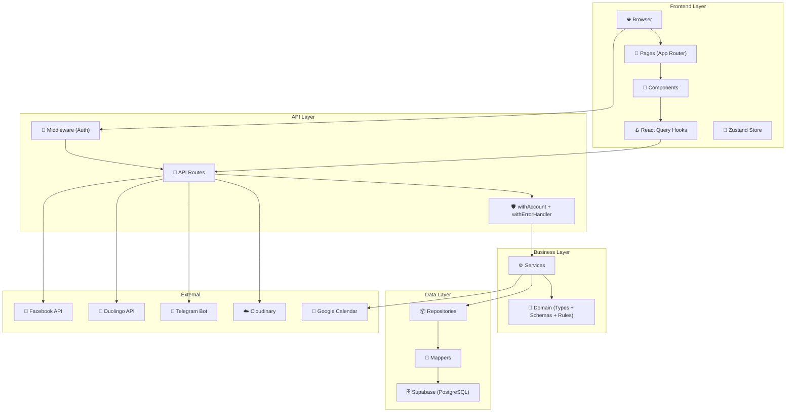
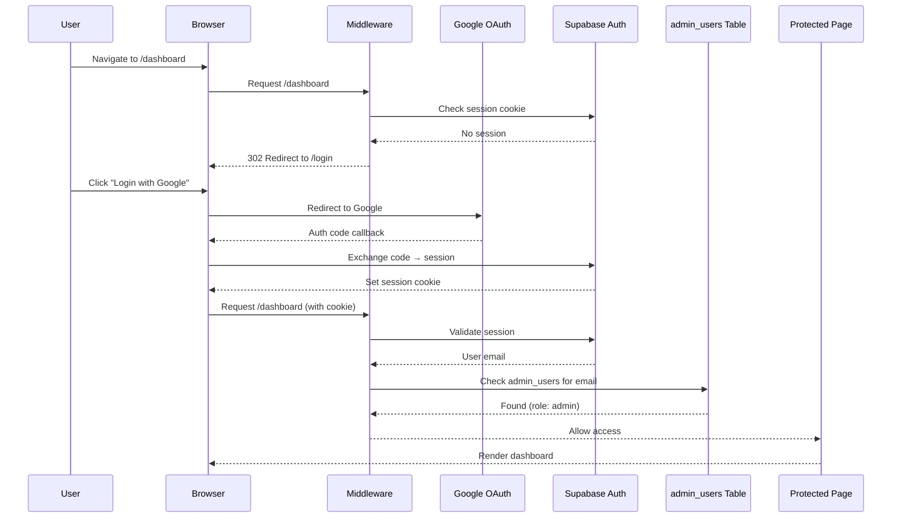
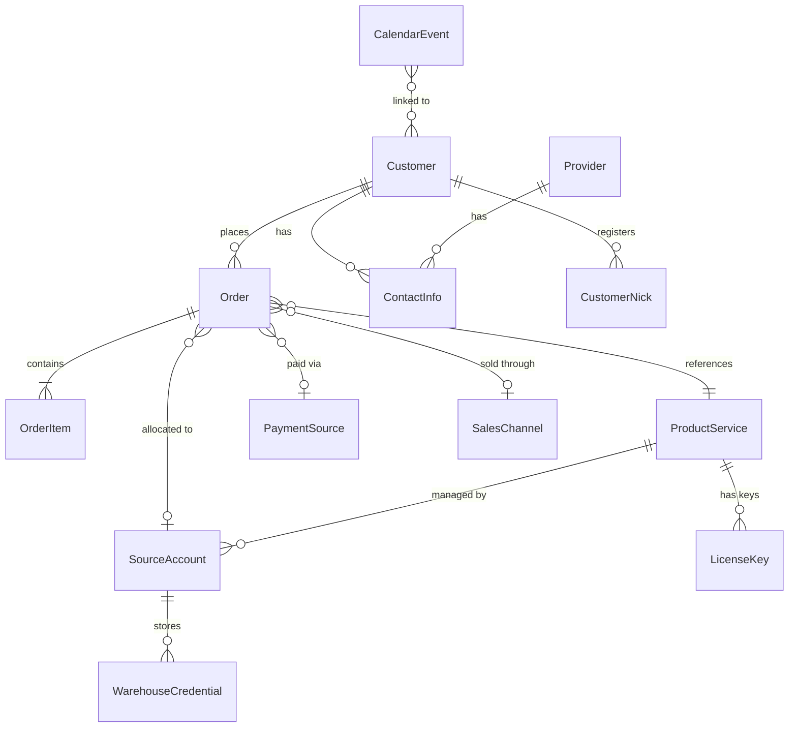

# 🏗️ Architecture — Premium Accounts Management System

**Version:** 2.0  
**Last Updated:** 2026-03-10  
**Tech Stack:** Next.js 16 · React 19 · Supabase · TypeScript

---

## Mục Lục

1. [Tech Stack](#1-tech-stack)
2. [Folder Structure](#2-folder-structure)
3. [Layered Architecture](#3-layered-architecture)
4. [Authentication Flow](#4-authentication-flow)
5. [Data Flow](#5-data-flow)
6. [Domain Model](#6-domain-model)
7. [Database Overview](#7-database-overview)
8. [Integrations](#8-integrations)
9. [Deployment](#9-deployment)

---

## 1. Tech Stack

### Core

| Layer | Technology | Version | Purpose |
|-------|-----------|---------|---------|
| **Framework** | Next.js | 16 | App Router, Server Components, API Routes |
| **UI Library** | React | 19 | Components, Hooks |
| **Language** | TypeScript | 5 | Type safety |
| **Database** | Supabase (PostgreSQL) | — | Primary data store + Auth |
| **Deployment** | Vercel | — | Hosting, Edge Functions, Cron |

### Frontend

| Library | Purpose |
|---------|---------|
| TailwindCSS 3 | Utility-first styling |
| TanStack React Table 8 | Data tables with sorting/filtering |
| TanStack React Query 5 | Server state management + caching |
| Zustand 5 | Client state management |
| Framer Motion 12 | Animations & transitions |
| React Hook Form 7 + Zod 4 | Form handling + validation |
| Recharts 3 | Dashboard charts |
| Lucide React | Icons |
| Sonner 2 | Toast notifications |
| cmdk 1 | Command palette (Cmd+K) |
| date-fns 4 | Date formatting |

### Backend

| Library | Purpose |
|---------|---------|
| Supabase JS Client 2 | Database queries + RLS |
| Supabase SSR | Server-side auth |
| bcryptjs | Password hashing |
| jsonwebtoken | JWT token handling |
| googleapis | Google Calendar API |
| xlsx | Excel import parsing |

### DevTools

| Tool | Purpose |
|------|---------|
| Vitest 4 | Unit testing |
| ESLint 9 | Code quality |
| TanStack Query DevTools | React Query debugging |

---

## 2. Folder Structure

```
premium-admin-web/
├── docs/                         # 📚 Documentation
│   ├── API_REFERENCE.md          #   API endpoints reference
│   ├── ARCHITECTURE.md           #   This file
│   ├── COMPONENTS.md             #   UI components catalog
│   ├── DATABASE.md               #   Database schema docs
│   ├── 01-requirements/          #   Business requirements
│   ├── 02-architecture/          #   System design & rules
│   ├── 03-database/              #   Schema & setup
│   ├── 04-implementation/        #   Implementation guides
│   ├── 05-verification/          #   Testing & validation
│   └── 06-reference/             #   Quick reference
│
├── src/
│   ├── app/                      # 🗂️ Next.js App Router
│   │   ├── api/                  #   63 API route files (15 domains)
│   │   │   ├── auth/             #     Authentication
│   │   │   ├── orders/           #     Order management
│   │   │   ├── customers/        #     Customer CRM
│   │   │   ├── products/         #     Product catalog
│   │   │   ├── inventory/        #     License key management
│   │   │   ├── source-accounts/  #     Warehouse accounts
│   │   │   ├── providers/        #     Supplier management
│   │   │   ├── calendar/         #     Events + GCal sync
│   │   │   ├── settings/         #     System configuration
│   │   │   ├── activity-logs/    #     Audit trail
│   │   │   ├── proxy/            #     External API proxies
│   │   │   ├── upload/           #     File upload (Cloudinary)
│   │   │   ├── cron/             #     Scheduled jobs
│   │   │   ├── premium/          #     Legacy premium endpoints
│   │   │   └── v1/               #     Legacy v1 endpoints
│   │   │
│   │   ├── dashboard/            #   📊 Dashboard (KPIs, charts)
│   │   ├── orders/               #   📋 Order list + detail
│   │   ├── customers/            #   👥 Customer management
│   │   ├── inventory/            #   📦 Inventory management
│   │   ├── products/             #   📦 Product catalog
│   │   ├── premium/              #   ⭐ Premium management
│   │   ├── calendar/             #   📅 Calendar view
│   │   ├── activity-logs/        #   📜 Activity logs
│   │   ├── settings/             #   ⚙️ System settings
│   │   ├── providers/            #   🏢 Provider management
│   │   ├── login/                #   🔐 Login page
│   │   └── unauthorized/         #   🚫 Unauthorized page
│   │
│   ├── components/               # 🧩 UI Components
│   │   ├── shared/               #   33 reusable components
│   │   ├── orders/               #   11 order-specific
│   │   ├── inventory/            #   3 inventory-specific
│   │   ├── customers/            #   1 customer-specific
│   │   ├── calendar/             #   4 calendar-specific
│   │   ├── settings/             #   3 settings-specific
│   │   └── providers/            #   1 provider-specific
│   │
│   ├── lib/                      # 📦 Business Logic Layer
│   │   ├── api/                  #   API middleware (withAccount, withError)
│   │   ├── domain/               #   Domain types + schemas + business rules
│   │   ├── hooks/                #   13 React Query hooks
│   │   ├── services/             #   4 business services
│   │   ├── supabase/             #   Supabase client + repositories
│   │   │   └── repositories/     #     10 data access repos
│   │   ├── integrations/         #   Google Calendar integration
│   │   ├── utils/                #   Utilities & helpers
│   │   ├── types/                #   Additional type definitions
│   │   └── cache/                #   Caching utilities
│   │
│   ├── hooks/                    #   App-level hooks
│   ├── middleware.ts             #   Auth + routing middleware
│   └── tests/                    #   Test files
│
├── supabase/                     # 🗄️ Database
│   └── migrations/               #   14 migration files
│
├── public/                       #   Static assets
├── scripts/                      #   Utility scripts
├── next.config.ts                #   Next.js configuration
├── tailwind.config.ts            #   Tailwind configuration
├── vitest.config.ts              #   Test configuration
└── vercel.json                   #   Deployment + cron config
```

---

Current implementation keeps shared UI in `src/shared/ui`, shared hooks in `src/shared/hooks`, feature-local logic in `src/features/**`, and route-local composition in `src/widgets/pages/**`.

## 3. Layered Architecture



### Layer Responsibilities

| Layer | Files | Purpose |
|-------|-------|---------|
| **Pages** | `src/app/*/page.tsx` | Route rendering, SEO metadata |
| **Widgets** | `src/widgets/pages/**` | Route-local page composition and client wrappers |
| **Shared UI** | `src/shared/ui/**` | Reusable UI elements, forms, modals, tables |
| **Hooks** | `src/shared/hooks/**`, `src/features/**/hooks/**` | Shared and feature-local data fetching, mutations, caching via React Query |
| **API Routes** | `src/app/api/**/route.ts` | HTTP handlers, validation, response |
| **Middleware** | `withAccount`, `withErrorHandler` | Auth, error wrapping |
| **Services** | `src/lib/services/*` | Complex business logic (allocation, order creation) |
| **Domain** | `src/lib/domain/*` | Types, Zod schemas, state machines, policies |
| **Repositories** | `src/lib/supabase/repositories/*` | Data access, queries, CRUD |
| **Mappers** | `src/lib/supabase/mappers.ts` | DB row → Domain model conversion |

---

## 4. Authentication Flow



### Key Points:
- **Session:** Cookie-based qua Supabase SSR
- **Authorization:** Email phải tồn tại trong `admin_users` table
- **API Auth:** Returns `401` (no session) hoặc `403` (not admin) JSON
- **Public Routes:** `/login`, `/unauthorized`, `/api/auth/*`

---

## 5. Data Flow

### Read Flow (Frontend → Backend)

```
Component → useOrders() hook
  → React Query fetcher → fetch("/api/orders?page=1")
    → middleware (auth check)
    → withErrorHandler → withAccount
      → ordersRepo.getOrdersPaginated(accountId, opts)
        → supabaseAdmin.from("orders").select(...)
    ← JSON { data: [...], meta: {...} }
  ← React Query cache
← Component renders with data
```

### Write Flow (Create Order)

```
OrderForm → onSubmit
  → zodSchema.parse(formData)
  → useMutation → fetch POST /api/orders
    → middleware → withAccount
      → createOrderInputSchema.parse(body)
      → orderService.createOrderWithItems(accountId, data)
        → ordersRepo → supabaseAdmin.from("orders").insert(...)
        → ordersRepo → supabaseAdmin.from("order_items").insert(...)
        → activityLogsRepo → createActivityLog(...)
    ← 201 { data: { order + items } }
  ← invalidateQueries(["orders"]) → auto-refetch
← Toast notification → UI update
```

---

## 6. Domain Model



### Core Entities

| Entity | Location | Key Fields |
|--------|----------|-----------|
| `Order` | `domain/types.ts` | id, customerId, items, status, totalAmountVnd, paymentMethod |
| `Customer` | `domain/types.ts` | id, name, contacts, tier, nicksRegistry |
| `ProductService` | `domain/types.ts` | id, name, mode (slot/key/hybrid), prices, duration |
| `SourceAccount` | `domain/types.ts` | id, email, provider, maxSlots, usedSlots, credentials |
| `OrderItem` | `domain/types.ts` | productId, quantity, priceVnd, assignedSourceAccountId |
| `CalendarEvent` | `domain/types.ts` | id, title, date, type, customerIds, gcalEventId |

### Value Objects & Enums

| Type | Values |
|------|--------|
| `OrderStatus` | `draft` · `pending_payment` · `paid` · `provisioning` · `active` · `expired` · `refunded` |
| `ProductMode` | `slot` · `key` · `hybrid` |
| `PaymentMethod` | `paid` · `debt` · `cod` |
| `ContactInfo.type` | `phone` · `email` · `zalo` · `facebook` · `telegram` · `other` |
| `Role` | `admin_owner` · `sales_staff` · `inventory_staff` · `customer_support` · `accountant` |

### Business Services (4)

| Service | File | Responsibility |
|---------|------|----------------|
| **OrderService** | `order.service.ts` | Create order with items, price snapshot, expiry calculation |
| **AllocationService** | `allocation.service.ts` | Smart matching, slot/key allocation, deallocation |
| **SmartMatchingService** | `smart-matching.service.ts` | Auto-match orders to source accounts |
| **AuthService** | `auth.ts` | Google OAuth, admin verification, session management |

---

## 7. Database Overview

### Tables

| Group | Tables | Count |
|-------|--------|-------|
| **Core** | `accounts`, `admin_users`, `customers`, `customer_contacts`, `orders`, `order_items` | 6 |
| **Products** | `products`, `license_keys` | 2 |
| **Warehouse** | `source_accounts`, `order_source_links` | 2 |
| **Premium** | `premium_service_types`, `premium_packages`, `premium_accounts`, `premium_account_users`, `customer_premium_subscriptions`, `premium_account_health_logs`, `premium_account_user_history`, `subscription_renewals`, `account_migrations`, `account_migration_history` | 10 |
| **Settings** | `system_settings`, `payment_sources`, `sales_channels` | 3 |
| **Events** | `reminder_events`, `calendar_notes` | 2 |
| **Audit** | `activity_logs` | 1 |
| **Providers** | `providers` | 1 |

**Xem chi tiết:** [DATABASE.md](DATABASE.md)

### Supabase Features Used
- ✅ Row Level Security (RLS)
- ✅ Realtime subscriptions  
- ✅ PostgreSQL functions & triggers
- ✅ Auto-generated TypeScript types (`database.types.ts`)
- ✅ Server-side auth (SSR)

---

## 8. Integrations

### Google Calendar
- **File:** `src/lib/integrations/google-calendar.ts`
- **Purpose:** Sync calendar events (create/update/delete)
- **Auth:** Google Service Account
- **Env:** `GOOGLE_CALENDAR_ID`, `GOOGLE_SERVICE_ACCOUNT_KEY`

### Cloudinary
- **File:** `src/app/api/upload/route.ts`
- **Purpose:** Image upload (payment proof)
- **Fallback:** Base64 data URL khi chưa cấu hình
- **Env:** `CLOUDINARY_CLOUD_NAME`, `CLOUDINARY_API_KEY`, `CLOUDINARY_API_SECRET`

### Telegram Bot
- **File:** `src/app/api/cron/telegram-reminder/route.ts`
- **Purpose:** Daily reminder notifications
- **Schedule:** 6AM & 9PM (VN timezone)
- **Env:** `TELEGRAM_BOT_TOKEN`, `TELEGRAM_CHAT_ID`

### External APIs (Proxy)
- **Duolingo API** — Resolve username → user ID
- **Facebook API** — Resolve profile URL → user ID

---

## 9. Deployment

### Platform: Vercel

```jsonc
// vercel.json
{
  "crons": [
    { "path": "/api/cron/telegram-reminder", "schedule": "0 23 * * *" },
    { "path": "/api/cron/telegram-reminder", "schedule": "0 14 * * *" }
  ]
}
```

### Environment Variables

| Category | Variables |
|----------|----------|
| **Supabase** | `NEXT_PUBLIC_SUPABASE_URL`, `NEXT_PUBLIC_SUPABASE_ANON_KEY`, `SUPABASE_SERVICE_ROLE_KEY` |
| **Auth** | `NEXTAUTH_SECRET`, `NEXT_PUBLIC_TEST_ACCOUNT_ID` |
| **Google** | `GOOGLE_CALENDAR_ID`, `GOOGLE_SERVICE_ACCOUNT_KEY` |
| **Cloudinary** | `CLOUDINARY_CLOUD_NAME`, `CLOUDINARY_API_KEY`, `CLOUDINARY_API_SECRET` |
| **Telegram** | `TELEGRAM_BOT_TOKEN`, `TELEGRAM_CHAT_ID` |
| **Cron** | `CRON_SECRET` |

---

*Tài liệu kiến trúc — Antigravity Documentation Generator — 2026-03-10*
