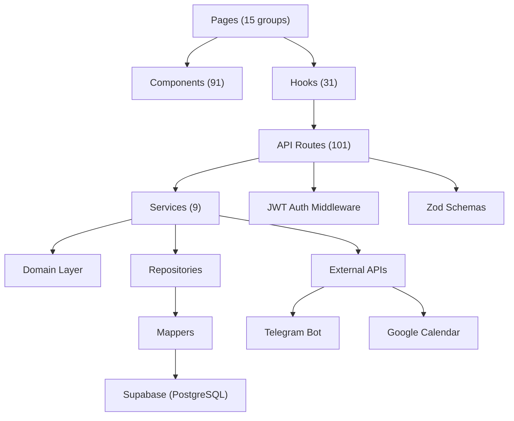

# Kiến trúc hệ thống — ManagerOrder

> Clean Architecture + Domain-Driven Design trên Next.js App Router

---

## 1. Architecture Overview

```
┌──────────────────────────────────────────────────────┐
│                  PRESENTATION LAYER                   │
│   Next.js Pages (SSR/CSR) + 91 React Components      │
│   31 React Query Hooks + Zustand Stores               │
├──────────────────────────────────────────────────────┤
│                     API LAYER                         │
│   101 REST API Routes (Next.js Route Handlers)        │
│   JWT Auth Middleware + Zod Validation                 │
│   6 Cron Job Routes                                   │
├──────────────────────────────────────────────────────┤
│                   SERVICE LAYER                       │
│   9 Business Services (order, allocation, auth,       │
│   escalation, event-bus, smart-matching, rfm,         │
│   import, excel)                                      │
├──────────────────────────────────────────────────────┤
│                   DOMAIN LAYER                        │
│   Types, Zod Schemas, Order FSM, Allocation Engine    │
├──────────────────────────────────────────────────────┤
│              DATA ACCESS LAYER                        │
│   Supabase Repos + Mappers + Cache Layer              │
│   PostgreSQL RPC (Atomic Transactions)                │
├──────────────────────────────────────────────────────┤
│               INFRASTRUCTURE                          │
│   Supabase (PostgreSQL + Auth + Storage)              │
│   Telegram Bot API + Google Calendar API              │
│   Vercel (Hosting + Cron + Edge)                      │
└──────────────────────────────────────────────────────┘
```

---

## 2. Layer Details

### 2.1 Presentation Layer

| Thành phần | Chi tiết |
|------------|----------|
| **Pages** | 15 page groups: dashboard, orders, customers, inventory, calendar, settings, premium, etc. |
| **Components** | 91 components chia 8 nhóm: `orders/` (20), `customers/` (13), `inventory/` (12), `premium/` (12), `settings/` (10), `calendar/` (5), `shared/` (12), `ui/` (7) |
| **Hooks** | 31 React Query hooks (`use-orders`, `use-customers`, `use-inventory`, etc.) |
| **Stores** | Zustand stores cho client-side state |
| **Forms** | React Hook Form + Zod validation |

### 2.2 API Layer

```
src/app/api/
├── auth/           # login, register, refresh, google-oauth
├── orders/         # CRUD + stats + batch + export + import + renewal + refund
├── customers/      # CRUD + stats + batch + RFM + debt + nicks
├── inventory/      # CRUD + allocate + deallocate + dashboard + profit
├── premium/        # services, packages, accounts, users, subscriptions
├── calendar/       # events + notes
├── dashboard/      # stats, revenue, order stats
├── products/       # CRUD
├── providers/      # CRUD
├── settings/       # system settings, webhook endpoints
├── cron/           # 6 scheduled jobs
├── webhooks/       # incoming webhook handler
├── activity-logs/  # audit trail
├── upload/         # file upload
└── trash/          # soft-delete management
```

**Auth Pattern:**
```typescript
// Mọi API route đều authenticate qua JWT
const jwtPayload = await verifyAuth(request);
const accountId = jwtPayload.accountId; // Multi-tenant isolation
```

### 2.3 Service Layer

| Service | File | Trách nhiệm |
|---------|------|-------------|
| **OrderService** | `order.service.ts` | Tạo đơn atomic: validate → build items → RPC → slot update → nicks → log → emit |
| **AllocationService** | `allocation.service.ts` | Smart matching + atomic slot/key allocation via RPC |
| **AuthService** | `auth.ts` | Register, login, refresh — custom JWT (NOT Supabase Auth) |
| **EventBusService** | `event-bus.service.ts` | Webhook: emit → deliver → retry (HMAC-SHA256, exp backoff) |
| **EscalationService** | `escalation.service.ts` | Auto-escalation nợ: reminder → warning → lock → admin |
| **SmartMatchingService** | `smart-matching.service.ts` | Nick matching cho inventory allocation |
| **RFMCalculator** | `rfm-calculator.ts` | RFM segmentation tự động |
| **ImportService** | `import.service.ts` | Import Excel/CSV data |
| **ExcelService** | `excel-service.ts` | Export Excel templates |

### 2.4 Domain Layer

```
src/lib/domain/
├── types/                      # Core domain types
│   ├── order.types.ts          # Order, OrderItem, OrderStatus
│   ├── customer.types.ts       # Customer, CustomerTier, RFMSegment
│   ├── inventory.types.ts      # SourceAccount, LicenseKey, Slot
│   └── premium.types.ts        # PremiumService, Package, Subscription
├── schemas/                    # Zod validation schemas
├── order-state-machine.ts      # FSM transitions
└── allocation-engine.ts        # Allocation logic
```

**Order FSM:**
```
draft ──→ pending_payment ──→ paid ──→ provisioning ──→ active ──→ expired
  ↓           ↓                ↓          ↓               ↓         ↓
  └───────────┴────────────────┴──────────┴───────────────┴─→ refunded
                                                            (expired → active: renewal)
```

### 2.5 Data Access Layer

**Repository Pattern:**
```typescript
// src/lib/supabase/repositories/orders.repo.ts
export async function listOrders(accountId: string, filters: OrderFilters) {
  // Tất cả queries đều filter theo account_id (multi-tenant)
}
```

**Mapper Pattern:**
```typescript
// src/lib/supabase/mappers/orders.mapper.ts
export function mapOrderRow(row: DbOrderRow): Order { ... }
export function mapOrderToDB(order: Order): DbOrderRow { ... }
```

**PostgreSQL RPC (Atomic Transactions):**

| RPC | Mục đích |
|-----|----------|
| `create_order_with_items` | Atomic order + items creation |
| `confirm_allocation_atomic` | Lock + allocate slots + keys |
| `deallocate_order_atomic` | Batch release slots + keys |
| `increment_source_account_slots` | Atomic slot increment |
| `allocate_license_keys` | Atomic key allocation |

---

## 3. Cross-Cutting Concerns

### 3.1 Multi-Tenancy

Mọi dữ liệu được isolate theo `account_id`:

```
JWT Token → accountId → WHERE account_id = $1 (mọi query)
```

### 3.2 Caching

```typescript
// src/lib/cache/db-cache.ts
// Cache key pattern: '{entity}:list:{accountId}'
invalidate('orders:list:${accountId}'); // Invalidate sau write
```

### 3.3 Event-Driven (Webhooks)

```
Order Created → EventBus → Webhook Delivery
  ↓                            ↓
Events:                    HMAC-SHA256 signed
  order.created            10s timeout
  order.status_changed     Retry: 1min → 5min → 30min
  payment.received         SSRF protection (block internal IPs)
  subscription.expired
  refund.completed
```

### 3.4 Error Handling

```typescript
// Centralized error pattern
class AppError extends Error {
  constructor(message: string, public statusCode: number, public code: string) {}
}
// API routes catch → return NextResponse.json({ error }, { status })
```

### 3.5 Activity Logging

```
Mọi mutation → activity_logs table
  action: 'create' | 'update' | 'delete'
  entity_type: 'order' | 'customer' | 'inventory' | ...
  entity_id, changes, user_id, timestamp
```

---

## 4. Data Flow Diagrams

### 4.1 Tạo đơn hàng

```
User → CreateOrderForm
  → POST /api/orders
    → Zod validate
    → Check duplicate
    → Build order items (price snapshot)
    → RPC create_order_with_items
    → Update source account slots
    → Sync customer nicks
    → Log activity
    → Emit webhook event
  ← Return order data
← Update React Query cache
```

### 4.2 Cấp phát kho

```
Admin → AllocationPanel
  → SmartMatchingService.suggest(orderId)
    → Find matching source accounts
    → Rank by availability + compatibility
  ← Suggestions list

Admin confirms →
  → POST /api/inventory/allocate
    → RPC confirm_allocation_atomic
      → Advisory lock
      → Check slot availability
      → Increment used_slots
      → Update order_items (assigned account)
      → Mark license keys (if applicable)
    ← Allocated items
  ← Update UI
```

### 4.3 Cron Job Flow

```
Vercel Scheduler (cron)
  → GET /api/cron/{job}?secret=CRON_SECRET
    → Verify CRON_SECRET
    → Execute job logic
    → Send Telegram notifications
    → Log results
  ← 200 OK + summary
```

---

## 5. Security Architecture

| Layer | Mechanism |
|-------|-----------|
| **API Auth** | Custom JWT (access + refresh tokens) |
| **RBAC** | 5 roles, checked at API route level |
| **Multi-tenant** | `account_id` filter on every query |
| **Passwords** | bcrypt hashing (NOT plain text) |
| **Webhooks** | HMAC-SHA256 signature verification |
| **SSRF** | Block internal IPs for webhook URLs |
| **Secrets** | Environment variables (never hardcoded) |
| **Validation** | Zod schemas on all inputs |

---

## 6. Module Dependency Map



---

*Cập nhật: 2026-03-14*
