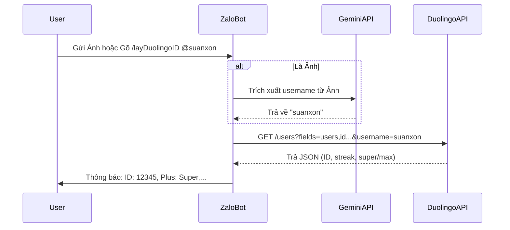

# Kế hoạch Tích hợp Trợ lý AI và Tra cứu Đơn hàng cho Zalo Bot

Bản kế hoạch này mô tả kiến trúc và luồng xử lý chi tiết theo yêu cầu của bạn, bao gồm AI phân tích hình ảnh, tra cứu Duolingo ID và bảo mật dữ liệu đơn hàng.

## 1. Yêu cầu & Quyết định Kiến trúc

1. **AI xử lý ảnh**: 
   - Hỗ trợ lưu cấu hình bot, khi khách hàng gửi thẻ ảnh chụp -> Dùng Google Gemini 1.5 phân tích ảnh để trích xuất `username` của Duolingo.
2. **Duolingo Username -> Chi Tiết / ID (Lệnh `/layDuolingoID`)**:
   - Từ username lấy được qua ảnh hoặc khách nhắn thẳng (hỗ trợ cả định dạng `@username` hoặc `username`).
   - Gọi API: `https://www.duolingo.com/2017-06-30/users?fields=users,id&username=[TÊN]`.
   - Trả về Full thông tin: `id`, trạng thái Plus (`super`/`max`), chuỗi ngày học (`streak`), và các trường thông tin cơ bản khác một cách hiển thị đẹp mắt.
   - Thêm câu gợi ý nhắc lệnh khi khách hàng nhắn sai cú pháp (vd: cung cấp command list).
3. **Tra cứu đơn hàng (Option D + Mã/Username)**:
   - Áp dụng **Option D**: Cho phép nhập SĐT, Mã Đơn, hoặc Username Duolingo để tra cứu trực tiếp.
   - Giới hạn Rate Limit: Mỗi Zalo ID trong 1 ngày chỉ được phép Request tra cứu thành công một số lượng SĐT nhất định (VD: 3 SĐT khác nhau / ngày) để tránh bị rà quét dữ liệu.
4. **Quản lý lệnh của Bot**:
   - Menu hướng dẫn người dùng: Hiện thông tin các lệnh bot đang hỗ trợ khi khách hàng gõ `/help` hoặc lệnh không tồn tại.

---

## 2. Luồng Xử lý Thuật toán

### 2.1. Lệnh `/layDuolingoID` (Tra cứu thông tin Duolingo)


### 2.2. Tra Cứu Đơn hàng (Giới hạn Rate API)
```text
IF user yêu cầu tra cứu (cung cấp {keyword}):
   Lấy Zalo_User_ID
   Đếm số Keyword đã tra cứu hôm nay của Zalo_User_ID (Redis / SQLite / Supabase lookup_logs)
   IF count > 3: 
       -> Chặn, báo "Bạn đã hết lượt tra cứu hôm nay để đảm bảo bảo mật."
   ELSE:
       -> Ghi log Keyword.
       -> Query Supabase tìm "order" match SĐT/Mã đơn.
       -> Trả kết quả cho khách.
```

---

## 3. Các thành phần Code cần xây dựng

1. **AI Image Processing (`src/ai/GeminiAIService.ts`)**: 
   - Thêm phương thức tải hình ảnh từ URL (Zalo URL) xuống memory buffer, gắn base64 vào prompt để ném về Google Gemini API.
2. **Duolingo API Client (`src/services/DuolingoService.ts`)**:
   - Viết class fetching dữ liệu từ Duolingo, parse fields về interface chuẩn ném lỗi rõ ràng nếu user sai/không tồn tại.
3. **Lệnh Bot Controller (`src/handlers/CommandHandler.ts` & `MessageHandler.ts`)**:
   - Tách/Thêm hàm lắng nghe `/layDuolingoID`.
   - Lắng nghe event message loại `picture` (nếu khách gửi ảnh không kèm chữ), sau đó forward sang Gemini.
4. **Rate Limiting Tracker (`src/services/SupabaseCustomerTracker.ts`)**:
   - Update Table tại database: Tạo một table/tracker lưu log tra cứu. (Cột: `zalo_user_id`, `keyword_searched`, `created_date`).
   - Query đếm số log để giới hạn trong ngày.

---

## 4. Kiểm tra trước khi thực thi

> [!NOTE]  
> Các tính năng được mô tả ở trên đã khớp 100% với yêu cầu cập nhật của bạn. Hệ thống sẽ tích hợp Gemini cho Hình ảnh, Duolingo API cho username, và Rate-Limit 3 lần/ngày chống quét SĐT (lookup Supabase).

**Hãy gõ "OK" hoặc "Đồng ý" để tôi tự động bắt đầu sinh code và chỉnh sửa dự án.**
